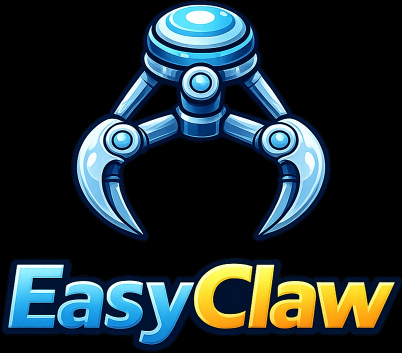

<p align="center">
  
</p>

Desktop runtime manager for [OpenClaw](https://github.com/nicejudy/openclaw). A system-tray Electron app that launches and manages an OpenClaw gateway, exposes a local management panel for configuring rules, providers, channels, and permissions, and ships with auto-update support.

## Prerequisites

| Tool    | Version    |
| ------- | ---------- |
| Node.js | >= 22.12.0 |
| pnpm    | 10.6.2     |

## Quick Start

```bash
pnpm install
pnpm build
pnpm --filter @easyclaw/desktop dev
```

This starts the Electron tray app, which spawns the OpenClaw gateway and serves the management panel at `http://localhost:3210`.

## Repository Structure

```
easyclaw/
├── apps/
│   ├── desktop/          # Electron tray app (main process)
│   └── panel/            # React management UI (served by desktop)
├── packages/
│   ├── core/             # Shared types & Zod schemas
│   ├── gateway/          # Gateway lifecycle, config writer, secret injection
│   ├── logger/           # Structured logging (tslog)
│   ├── storage/          # SQLite persistence (better-sqlite3)
│   ├── rules/            # Rule compilation & skill file writer
│   ├── secrets/          # Keychain / DPAPI / file-based secret stores
│   ├── updater/          # Auto-update client
│   ├── telemetry/        # Usage tracking
│   ├── stt/              # Speech-to-text abstraction
│   └── openclaw-plugin/  # OpenClaw plugin SDK
├── extensions/
│   ├── dingtalk/         # DingTalk channel integration
│   └── wecom/            # WeCom channel integration
├── scripts/
│   └── release.sh        # Build installers + update website
├── vendor/
│   └── openclaw/         # Vendored OpenClaw binary (gitignored)
└── website/              # Static site + nginx/docker for hosting releases
```

## Workspaces

The monorepo uses pnpm workspaces (`apps/*`, `packages/*`, `extensions/*`) with [Turbo](https://turbo.build) for build orchestration. All packages produce ESM output via [tsdown](https://github.com/nicolo-ribaudo/tsdown).

### Apps

| Package             | Description                                                                                                            |
| ------------------- | ---------------------------------------------------------------------------------------------------------------------- |
| `@easyclaw/desktop` | Electron 35 tray app. Manages gateway lifecycle, hosts the panel server on port 3210, stores data in SQLite.           |
| `@easyclaw/panel`   | React 19 + Vite 6 SPA. Pages for rules, providers, channels, permissions, usage, and a first-launch onboarding wizard. |

### Packages

| Package                     | Description                                                                                                                                                                            |
| --------------------------- | -------------------------------------------------------------------------------------------------------------------------------------------------------------------------------------- |
| `@easyclaw/core`            | Zod-validated types: `Rule`, `ChannelConfig`, `PermissionConfig`, `ModelConfig`, LLM provider definitions (OpenAI, Anthropic, DeepSeek, Zhipu, Moonshot, Qwen), region-aware defaults. |
| `@easyclaw/gateway`         | `GatewayLauncher` (spawn/stop/restart with exponential backoff), config writer, secret injection from system keychain, skills directory watcher for hot reload.                        |
| `@easyclaw/logger`          | tslog-based logger. Writes to `~/.easyclaw/logs/`.                                                                                                                                     |
| `@easyclaw/storage`         | SQLite via better-sqlite3. Repositories for rules, artifacts, channels, permissions, settings. Migration system included. DB at `~/.easyclaw/easyclaw.db`.                             |
| `@easyclaw/rules`           | Rule compilation, skill lifecycle (activate/deactivate), skill file writer that materializes rules as SKILL.md files for OpenClaw.                                                     |
| `@easyclaw/secrets`         | Platform-aware secret storage. macOS Keychain, file-based fallback, in-memory for tests.                                                                                               |
| `@easyclaw/updater`         | Checks `update-manifest.json` on the website, notifies user of new versions.                                                                                                           |
| `@easyclaw/telemetry`       | Token usage and session tracking.                                                                                                                                                      |
| `@easyclaw/stt`             | Speech-to-text provider abstraction.                                                                                                                                                   |
| `@easyclaw/openclaw-plugin` | OpenClaw plugin SDK integration.                                                                                                                                                       |

## Scripts

All root scripts run through Turbo:

```bash
pnpm build        # Build all packages (respects dependency graph)
pnpm dev          # Run desktop + panel in dev mode
pnpm test         # Run all tests (vitest)
pnpm lint         # Lint all packages (oxlint)
pnpm format       # Check formatting (oxfmt)
pnpm format:fix   # Auto-fix formatting
```

### Per-package

```bash
# Desktop
pnpm --filter @easyclaw/desktop dev        # Launch Electron in dev mode
pnpm --filter @easyclaw/desktop build      # Bundle main process
pnpm --filter @easyclaw/desktop test       # Run desktop tests
pnpm --filter @easyclaw/desktop dist:mac   # Build macOS DMG (universal)
pnpm --filter @easyclaw/desktop dist:win   # Build Windows NSIS installer

# Panel
pnpm --filter @easyclaw/panel dev          # Vite dev server
pnpm --filter @easyclaw/panel build        # Production build

# Any package
pnpm --filter @easyclaw/core test
pnpm --filter @easyclaw/gateway test
```

## Architecture

```
┌─────────────────────────────────────────┐
│  System Tray (Electron main process)    │
│  ├── GatewayLauncher → vendor/openclaw  │
│  ├── Panel HTTP Server (:3210)          │
│  │   ├── Static files (panel dist/)     │
│  │   └── REST API (/api/*)              │
│  ├── SQLite Storage                     │
│  └── Auto-Updater                       │
└─────────────────────────────────────────┘
         │                    ▲
         ▼                    │
┌─────────────┐    ┌─────────────────┐
│  OpenClaw   │    │  Panel (React)  │
│  Gateway    │    │  localhost:3210  │
│  Process    │    └─────────────────┘
└─────────────┘
```

The desktop app runs as a **tray-only** application (hidden from the dock on macOS). It:

1. Spawns the OpenClaw gateway from `vendor/openclaw/`
2. Serves the panel UI and REST API on `localhost:3210`
3. Writes gateway config to `~/.openclaw/gateway/config.yml`
4. Injects secrets from the system keychain at runtime
5. Watches `~/.openclaw/skills/` for hot-reload of rule-generated skill files

### REST API

The panel server exposes these endpoints:

| Endpoint           | Methods                | Description                               |
| ------------------ | ---------------------- | ----------------------------------------- |
| `/api/rules`       | GET, POST, PUT, DELETE | CRUD for rules                            |
| `/api/channels`    | GET, POST, PUT, DELETE | Channel management                        |
| `/api/permissions` | GET, POST, PUT, DELETE | Permission management                     |
| `/api/settings`    | GET, PUT               | Key-value settings store                  |
| `/api/providers`   | GET                    | Available LLM providers                   |
| `/api/status`      | GET                    | System status (rule count, gateway state) |

### Data Directories

| Path                             | Purpose                    |
| -------------------------------- | -------------------------- |
| `~/.easyclaw/easyclaw.db`        | SQLite database            |
| `~/.easyclaw/logs/`              | Application logs           |
| `~/.openclaw/`                   | OpenClaw state directory   |
| `~/.openclaw/gateway/config.yml` | Gateway configuration      |
| `~/.openclaw/sessions/`          | WhatsApp sessions          |
| `~/.openclaw/skills/`            | Auto-generated skill files |

## Building Installers

### macOS (DMG, universal arm64+x64)

```bash
pnpm build
pnpm --filter @easyclaw/desktop dist:mac
# Output: apps/desktop/release/EasyClaw-<version>-universal.dmg
```

For code signing and notarization, set these environment variables:

```bash
CSC_LINK=<path-to-.p12-certificate>
CSC_KEY_PASSWORD=<certificate-password>
APPLE_ID=<your-apple-id>
APPLE_APP_SPECIFIC_PASSWORD=<app-specific-password>
APPLE_TEAM_ID=<team-id>
```

### Windows (NSIS installer, x64)

```bash
pnpm build
pnpm --filter @easyclaw/desktop dist:win
# Output: apps/desktop/release/EasyClaw Setup <version>.exe
```

Cross-compiling from macOS works (NSIS doesn't need Wine). For code signing on Windows, set:

```bash
CSC_LINK=<path-to-.pfx-certificate>
CSC_KEY_PASSWORD=<certificate-password>
```

### Automated Release

The `scripts/release.sh` script handles the full pipeline:

```bash
./scripts/release.sh 0.1.0
```

This will:

1. Set version in `apps/desktop/package.json`
2. Build all workspace packages
3. Build macOS DMG and Windows NSIS installer
4. Compute SHA-256 hashes
5. Copy installers to `website/site/releases/`
6. Update `website/site/update-manifest.json` and `website/site/index.html` with new hashes and download links

## Testing

Tests use [Vitest](https://vitest.dev/). Run all tests:

```bash
pnpm test
```

Run tests for a specific package:

```bash
pnpm --filter @easyclaw/storage test
pnpm --filter @easyclaw/gateway test
```

## Code Style

- **Linting**: [oxlint](https://oxc-project.github.io/) (Rust-based, fast)
- **Formatting**: [oxfmt](https://oxc-project.github.io/) (Rust-based, fast)
- **TypeScript**: Strict mode, ES2023 target, NodeNext module resolution

```bash
pnpm lint
pnpm format       # Check
pnpm format:fix   # Auto-fix
```

## Website & Deployment

The `website/` directory contains the static product site hosted at `www.easy-claw.com`:

```
website/
├── site/           # Static HTML/CSS/JS (i18n: EN/ZH/JA)
│   ├── index.html
│   ├── style.css
│   ├── i18n.js
│   ├── update-manifest.json
│   └── releases/   # Installer binaries (gitignored)
├── nginx/          # nginx config (HTTPS, redirect, caching)
├── docker-compose.yml
└── init-letsencrypt.sh
```

On the production server:

```bash
cd website
./init-letsencrypt.sh   # First-time SSL setup
docker compose up -d    # Start nginx + certbot
```

## License

See [LICENSE](LICENSE) for details.
